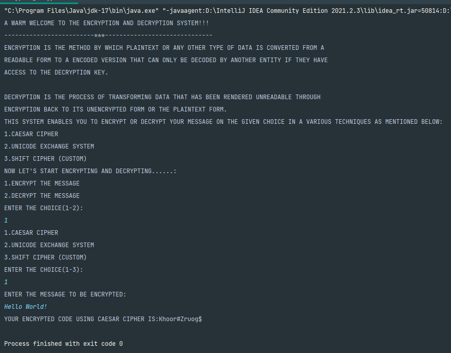
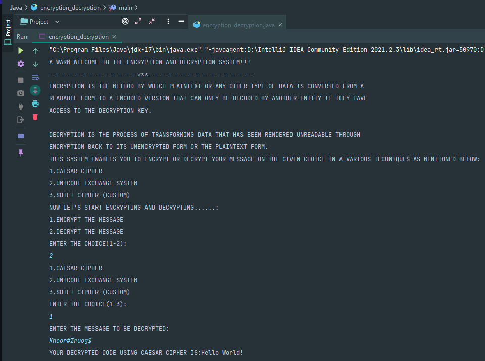
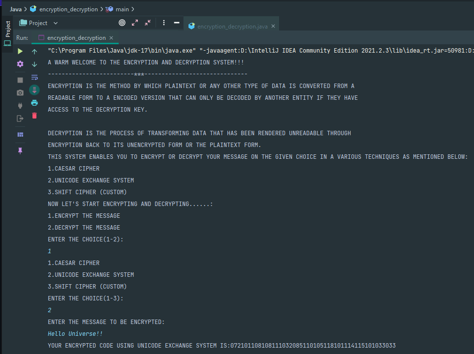
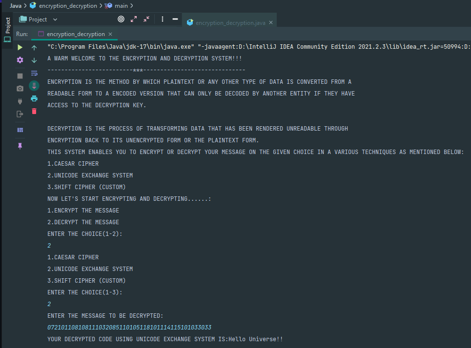
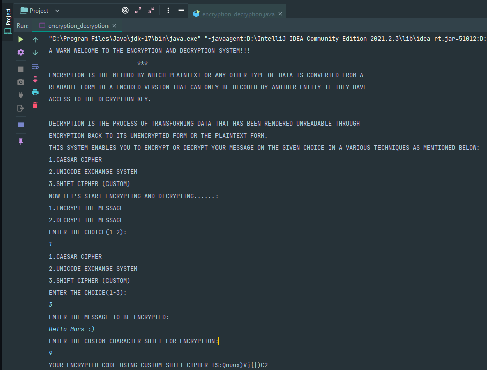

# Encryption and Decryption

Ciphers, also called encryption algorithms, are systems for encrypting and decrypting data. A cipher converts the original message, called plaintext, into ciphertext using a key to determine how it is done.

Ciphers are generally categorized according to how they work and by how their key is used for encryption and decryption. Block ciphers accumulate symbols in a message of a fixed size (the block), and stream ciphers work on a continuous stream of symbols. When a cipher uses the same key for encryption and decryption, they are known as symmetric key algorithms or ciphers. Asymmetric key algorithms or ciphers use a different key for encryption/decryption.

This Program encodes a given message using either of the below mentioned Ciphers:

## Ciphers Available in the Program

- Caesar Cipher
- Unicode Exchange System
- Custom Shift Cipher

# Caesar Cipher

It is a type of substitution cipher in which each letter in the plaintext is replaced by a letter some fixed number of positions down the alphabet. For example, with a left shift of 3, D would be replaced by A, E would become B, and so on. The method is named after Julius Caesar, who used it in his private correspondence

    Plaintext:  THE QUICK BROWN FOX JUMPS OVER THE LAZY DOG
    Ciphertext: QEB NRFZH YOLTK CLU GRJMP LSBO QEB IXWV ALD

# Unicode Exchange System

Unicode is a standard that precisely defines a character set as well as a small number of encodings for it. It enables you to handle text in any language efficiently. It allows a single application to work for a global audience.
# Custom Shift Cipher

Shift Ciphers work by using the modulo operator to encrypt and decrypt messages. The Shift Cipher has a key K, which is an integer from 0 to 25. We will only share this key with people that we want to see our message.
## Screenshots

### Encoding Using Caesar Cipher

### Decoding Using Caesar Cipher

### Encoding Using Unicode Exchange System

### Decoding Using Unicode Exchange System

### Encoding Using Custom Shift Cipher

### Encoding Using Custom Shift Cipher

